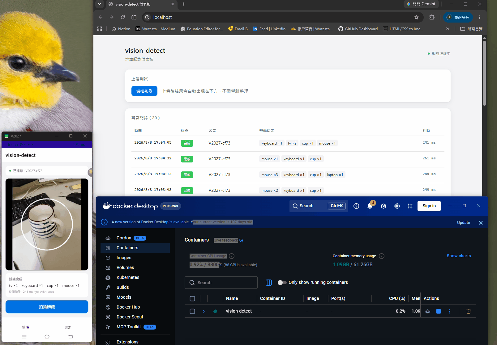
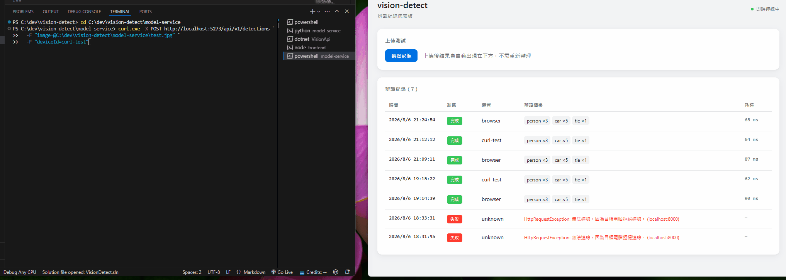

*[中文版本](README(zh).md)*

# vision-detect

> A distributed object detection system — capture on mobile, infer in Python, orchestrate in C#, review live on desktop.



A photo taken on a phone gains a row on the desktop dashboard in real time — no polling, no refresh.

**Status: Phase 1 in development.**

---

## Contents

- [Project Purpose](#project-purpose)
- [Skills This Project Aims to Build](#skills-this-project-aims-to-build)
- [Development Phases](#development-phases)
- [System Architecture](#system-architecture)
- [Deployment Topology](#deployment-topology)
- [API Contract](#api-contract)
- [Tech Stack](#tech-stack)
- [Testing Approach](#testing-approach)
- [Repository Layout](#repository-layout)
- [Known Limitations](#known-limitations)
- [Documentation](#documentation)
- [Licence](#licence)

---

## Project Purpose

Learn image detection through YOLO, and use C# to simulate an enterprise environment along with its failure scenarios.

**Enterprise aspects** — queueing, resilience, real-time push, permissions, observability
**Failure scenarios** — service timeouts, retries causing duplicate writes, upload succeeding while inference fails, deduplicating the same photo resent from a phone's offline queue

| Component | Learning focus |
|---|---|
| **Python inference service** | Applied computer vision — YOLO, preprocessing conventions, model serving, and later dataset and evaluation work |
| **C# business layer** | Distributed systems engineering — asynchronous job processing, real-time push, resilience, idempotency, observability |
| **Vue + MAUI clients** | Full-stack delivery — a dashboard and a mobile client against an asynchronous API |

**Intended functionality:** a phone photographs an object, the model identifies what is in the frame, the desktop dashboard updates in real time, and every detection is kept as searchable history.

Inference belongs to Python — training, augmentation, evaluation, and model iteration all live in that ecosystem.

C# owns the job lifecycle, persistence, device identity, deduplication, and the guarantees the clients depend on. The Python service is a stateless compute resource that can be restarted, scaled, or replaced without the business layer being affected.

---

## Skills This Project Aims to Build

**Designed as asynchronous from the outset.**
`POST /detections` does not wait for inference. It first persists the uploaded image, creates a `Pending` job, and immediately returns `202` with a job identifier. A background worker takes the job from the queue, calls the model service, and advances the record's state: `Pending → Processing → Done | Failed`.

**Real-time push.**
Completed detection results are pushed to connected clients over SignalR. As soon as a photo taken on a phone finishes processing, the desktop dashboard gains a row — no polling, no refresh.

**Idempotency at the contract level.**
Every capture carries a `requestId` generated by the client. Resends from the mobile offline queue, or duplicate submissions after a partial failure, resolve to the same record rather than creating a second one.

**Handling failure scenarios.**
Timeouts, model service restarts, and partial failures are modelled explicitly: retry with exponential backoff, a circuit breaker to avoid cascading load, and a `Failed` state that the dashboard surfaces.

---

## Development Phases

The project is developed in three phases.

| Phase | Theme | Status |
|---|---|---|
| Phase 1 | Working system — inference service and enterprise-grade backend environment | In progress |
| Phase 2 | PyTorch fundamentals — writing a training loop by hand | Planned |
| Phase 3 | Custom model — dataset, fine-tuning, evaluation report | Planned |

### Phase 1 — Working System

Complete the whole system with a COCO-pretrained model. No training.

| Deliverable | Expected benefit |
|---|---|
| Asynchronous job pipeline: `BackgroundService` + `Channel`, with an explicit state machine | Queue design, back-pressure, terminal-state handling |
| SignalR hub, subscribed to by both the dashboard and the mobile client | Real-time transport behind a reverse proxy, connection lifecycle |
| Resilience layer: timeout, exponential backoff retry, circuit breaker, idempotency key | The core lesson of distributed systems — there is no atomic operation across a service boundary |
| Python FastAPI inference service | Model serving, request schema design, container packaging |
| ASP.NET Core API + EF Core + PostgreSQL | Layered backend, upload handling, query and index design |
| Vue 3 dashboard | Live-updating table, filtering, pagination |
| .NET MAUI Android client | Camera permissions, capture, offline queue and resend |
| Docker Compose deployment | Four-service topology, reverse proxy including WebSocket upgrade |

**Progress**

- [x] Python FastAPI inference service
- [x] ASP.NET Core API + EF Core + PostgreSQL
- [x] Asynchronous queue and state machine
- [x] Idempotency (requestId deduplication)
- [x] SignalR real-time push + Vue dashboard
- [x] Polly resilience policies
- [x] .NET MAUI Android client
- [x] Docker Compose four-container deployment

### Phase 2 — PyTorch Fundamentals

Write a small image-classification project from scratch: `Dataset`, `DataLoader`, training loop, backpropagation, optimiser step.

**Expected benefit:** Ultralytics hides the training loop behind a YAML file.

A classification task is chosen deliberately — detection loss combines classification, localisation, and objectness terms.

### Phase 3 — Custom Model

Build a domain dataset, fine-tune, and evaluate.

| Deliverable | Expected benefit |
|---|---|
| Annotated dataset with documented class distribution | Data quality determines model quality — the least intuitive lesson in ML |
| Fine-tuned weights deployed to the inference service | Rolling out a model without touching the business layer |
| Evaluation report: mAP@50, mAP@50-95, per-class PR curves, confusion matrix | Understanding why plain "accuracy" is meaningless for detection |
| Failure analysis of the worst-performing samples | Most improvements come from fixing data, not tuning hyperparameters |

**An evaluation report lets the project speak in numbers**, rather than stopping at "used YOLO, works well".

---

## System Architecture

.png)

1. `InferenceWorker`, `ModelServiceClient`, and `DetectionHub` are the components that turn this system from a request-response wrapper into one whose behaviour under failure is well defined. The idempotency check lives inside `DetectionsController` rather than in a separate filter.

2. The upload path and the result path are deliberately separate. `POST` returns as soon as the job is persisted; the result arrives later over the hub. Both the dashboard and the mobile client subscribe to the same hub, which is why a photo taken on a phone appears on the desktop without anyone refreshing.



3. `Channel<Guid>` is an in-process queue. It is sufficient for a single API instance and keeps the deployment at four containers — but it does not survive a restart, and it cannot distribute across replicas. This trade-off is listed under [Known Limitations](#known-limitations).

> Diagram labels are in Traditional Chinese.

---

## Deployment Topology

.png)

The whole system starts with a single command:

```bash
cp .env.docker.example .env    # edit the password
docker compose up -d
```

**Only one port is published externally.**
Nginx serves the static assets, proxies `/api/*`, and upgrades `/hub/*` to WebSocket. The browser and the phone see a single origin, so no CORS configuration is needed.

**The model service is not reachable from outside.**
It is addressable only on the internal Docker network, and the business layer is its sole caller.

**WebSocket requires explicit proxy configuration.**
`proxy_http_version 1.1` together with the `Upgrade` and `Connection` headers. Without them, SignalR silently falls back to long polling, or fails to connect at all.

**Model weights are baked into the image at build time.**
To swap models, mount a volume over the weights directory and change the `MODEL_WEIGHTS` environment variable — no image rebuild required.

---

## API Contract

### `POST /api/v1/detections`

`multipart/form-data`:

| Field | Type | Description |
|---|---|---|
| `image` | file | JPEG or PNG |
| `requestId` | GUID | **Generated by the client**, deduplication key |
| `deviceId` | string | Device identifier |
| `capturedAt` | ISO 8601 | Capture time; may predate the upload after a network outage |

Returns `202 Accepted`:

```jsonc
{ "jobId": "...", "status": "Pending" }
```

A repeated `requestId` returns the original job rather than creating a new one — the status code is `200` in that case, so the client can tell the two apart.

### `GET /api/v1/detections/{jobId}`

Returns the current state, and the detection result once complete. Serves as a fallback when the hub connection is unavailable.

### `GET /api/v1/detections`

Paged history. Filters: `from`, `to`, `label`, `deviceId`, `status`.

### SignalR hub — `/hub/detections`

| Event | Payload |
|---|---|
| `DetectionCompleted` | Full detection record |
| `DetectionFailed` | Job id, failure reason, attempt count |

### Job states

```
Pending ──→ Processing ──→ Done
                │
                └──→ Failed   (retries exhausted, or a non-retryable error)
```

### Internal contract — between C# and the model service

```jsonc
// POST /infer response
{
  "model_version": "yolo-coco-v1",
  "inference_ms": 842,
  "image_width": 4032,
  "image_height": 3024,
  "detections": [
    {
      "label": "person", "class_id": 0, "confidence": 0.91,
      "x": 120, "y": 340, "width": 210, "height": 480
    }
  ]
}
```

Coordinates are **top-left corner plus width and height, in source-image pixels**. YOLO internally uses centre points and normalised dimensions; the conversion happens inside the model service.

`model_version` is written to the database with every record — without it, there is no way to tell where an accuracy change came from after swapping models in Phase 3.

**Error classification drives the retry policy**

| Status | `error` | Situation | C# behaviour |
|---|---|---|---|
| `400` | `invalid_image` | Corrupt file, unsupported format | No retry; mark `Failed` immediately |
| `413` | `image_too_large` | Exceeds the size limit | No retry |
| `503` | `model_not_ready` | Model still loading | Retry with backoff |
| `500` | `inference_error` | Unexpected error during inference | Retry, bounded attempts |

Returning `500` for everything would make the system retry a corrupt image three times before giving up — wasted time, and logs that look like an unstable service when the real problem is the input.

**Each layer keeps its own naming convention**

Python uses `snake_case`, C# uses `PascalCase`, and the public API emits `camelCase`. The two conversions are handled by `ModelServiceClient`'s `JsonSerializerOptions` and by ASP.NET's default serialisation respectively, so no layer has to accommodate another.

Full specification: [CONTRACT.md](model-service/CONTRACT.md).

---

## Tech Stack

| Layer | Technology | Phase |
|---|---|---|
| Business API | ASP.NET Core · EF Core | 1 |
| Asynchronous processing | `BackgroundService` · `System.Threading.Channels` | 1 |
| Real-time communication | SignalR | 1 |
| Resilience | Polly — timeout, retry, circuit breaker | 1 |
| Observability | Serilog · health checks · OpenTelemetry | 1 |
| Inference service | Python · FastAPI · Ultralytics YOLO | 1 |
| Database | PostgreSQL 16 | 1 |
| Frontend | Vue 3 · Vite · Pinia | 1 |
| Mobile | .NET MAUI (Android) | 1 |
| Containerisation | Docker · Docker Compose | 1 |
| Continuous integration | GitHub Actions | 1 |
| Training | PyTorch · Ultralytics | 3 |
| Evaluation | Python · matplotlib · scikit-learn | 3 |

---

## Testing Approach

Because inference sits behind an HTTP boundary, the business layer is tested against a **mocked model service** rather than a real one. Contract tests cover the scenarios that actually matter:

| Scenario | Expected behaviour |
|---|---|
| Model service returns 200 | Job reaches `Done`, hub event emitted exactly once |
| Model service times out | Retried per the backoff policy, ending in `Failed` |
| Model service returns 500 twice, then succeeds | Job reaches `Done`, no duplicate record created |
| Circuit breaker open | Fails fast without calling the service |
| Same `requestId` submitted twice | One record only; the second call returns the first job |
| Same `requestId` submitted **concurrently** | Arbitrated by a database unique index; still one record only |
| Upload succeeds but the worker crashes mid-job | The job is not silently lost |

This is closer to a production environment than testing the happy path, and it is where most of the design decisions are actually validated.

---

## Repository Layout

*Provisional; to be updated from the actual file tree as each phase lands.*

```
vision-detect/
├── model-service/      Python FastAPI inference service
├── backend/
│   └── src/
│       ├── VisionApi/                Controllers · Hubs · BackgroundServices
│       ├── VisionApi.Core/           entities · job state machine · interfaces
│       ├── VisionApi.Infrastructure/ model service client · resilience · storage
│       └── VisionApi.Data/           EF Core
├── frontend/           Vue 3 dashboard
├── mobile/             .NET MAUI client
├── docs/               diagrams and screenshots
└── docker-compose.yml
```

---

## Known Limitations

Stated plainly — these are decisions, not oversights:

| Limitation | Rationale |
|---|---|
| In-process queue rather than a durable message broker | Sufficient for a single instance; introducing a broker adds a container without teaching anything new at this stage |
| Single API instance | SignalR across replicas requires a backplane, which is outside this project's scope |
| No user accounts | Devices are identified by `deviceId`; authentication and authorisation are not modelled |
| Images stored on a local volume | Not object storage; adequate for a single-host deployment |
| No GPU | CPU inference; the latency is acceptable for a capture-then-review workflow |
| Android only | iOS requires a Mac to build; adding it back to `TargetFrameworks` needs no code changes |

Unresolved defects and the full set of trade-offs are documented in [ENGINEERING.md](docs/ENGINEERING.md).

---

## Documentation

| Document | Contents |
|---|---|
| [ENGINEERING.md](docs/ENGINEERING.md) | Design decisions, notable problems encountered, known limitations *(Traditional Chinese)* |
| [DEVELOPMENT.md](docs/DEVELOPMENT.md) | Local setup and verification steps *(Traditional Chinese)* |
| [CONTRACT.md](model-service/CONTRACT.md) | API contract between C# and the model service *(Traditional Chinese)* |

---

## Licence

### This project

This project is released under the **GNU Affero General Public License v3.0 (AGPL-3.0)**; see [`LICENSE`](LICENSE) for the full terms.

### For commercial use

An Ultralytics Enterprise License would be required, or a detection model under a more permissive licence (Apache-2.0, for example). The latter costs little to change under this architecture — the inference service is a separate container, so replacing the model does not affect the business layer or the clients.