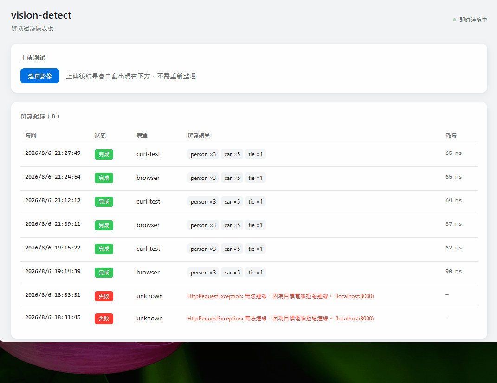

# 開發環境

本文件說明在本機啟動 vision-detect 的各個元件並驗證運作。

專案架構與設計說明見 [README](../README.md)。

---

## 前置需求

| 工具 | 版本 | 用途 |
|---|---|---|
| Docker Desktop | 最新版 | PostgreSQL 與 pgAdmin |
| .NET SDK | 8.0+ | C# 業務層 |
| Node.js | 20+ | Vue 儀表板 |
| Python | 3.12 | 模型推論服務 |
| Visual Studio 2026 | 含 .NET MAUI 工作負載 | 行動端 |

> 行動端非必要 —— 前四項就能完成主要功能的驗證。
> 桌機儀表板有上傳面板，不需要手機也能測試完整流程。

---

## 啟動


各元件分別啟動。除了資料庫之外，各開一個終端機視窗。

### 1. 資料庫

```powershell
cd C:\dev\vision-detect
docker compose up -d
docker compose ps
```

等 `vd_postgres` 顯示 **`Up (healthy)`** 再繼續。

> Docker Desktop 關閉或電腦重開後容器不會自動啟動，每次開發前都要執行這一步。
> 忘記的話，C# API 會在啟動時報 `Failed to connect to 127.0.0.1:5432`。

### 2. Python 推論服務（視窗 A）

```powershell
cd model-service
.\.venv\Scripts\python.exe -m uvicorn app.main:app --port 8000
```

看到 `Application startup complete.` 表示就緒。

> 用完整路徑呼叫 `python.exe` 是為了避開系統上多個 Python 版本的干擾。

### 3. C# API（視窗 B）

```powershell
cd backend\src\VisionApi
dotnet run
```

啟動訊息會顯示監聽的 port，例如 `Now listening on: http://localhost:5273`。

日誌出現 **`InferenceWorker 已啟動`** 表示背景工作者正常運作。

### 4. Vue 儀表板（視窗 C）

```powershell
cd frontend
npm run dev
```

打開 <http://localhost:5173>

### 5. 行動端

需要一台 Android 裝置或模擬器。

**無線偵錯連線**（手機端：設定 → 系統 → 開發人員選項 → 無線偵錯）

```powershell
$adb = "$env:LOCALAPPDATA\Android\Sdk\platform-tools\adb.exe"

# 首次配對：手機點「使用配對碼配對裝置」，用畫面顯示的 IP:PORT
& $adb pair 192.168.1.233:41723

# 連線：用無線偵錯「主畫面」顯示的 IP:PORT（與配對用的不同）
& $adb connect 192.168.1.233:38743

# 固定 port，避免每次重連都要看手機畫面
& $adb tcpip 5555
& $adb connect 192.168.1.233:5555

& $adb devices    # 確認只有一台，且狀態為 device
```

**部署**

```powershell
cd mobile\VisionCapture
dotnet build -t:Run -f net10.0-android
```

> 清單裡若同時出現 IP 連線與 mDNS 名稱（`adb-xxxx._adb-tls-connect._tcp`），
> 會出現 `more than one device/emulator`。先 `& $adb disconnect` 再只連 5555。

**設定伺服器位址**

app 首次啟動後切到「設定」分頁：

| 裝置 | 伺服器位址 |
|---|---|
| 實機 | `http://電腦的區網IP`（用 `ipconfig` 查） |
| 模擬器 | `http://10.0.2.2`（代表宿主機的固定位址） |

按「測試連線」確認成功後儲存。

> 實機連不上時，先用**手機瀏覽器**開同一個位址測試 —— 瀏覽器連得上但 app 連不上，才是 app 的問題。
> 防火牆需放行：
> ```powershell
> New-NetFirewallRule -DisplayName "vision-detect HTTP" `
>   -Direction Inbound -LocalPort 80 -Protocol TCP -Action Allow
> ```

---

## 各元件位址

| 元件 | 位址 | 說明 |
|---|---|---|
| Vue 儀表板 | <http://localhost:5173> | 主畫面 |
| C# API | `http://localhost:5273` | port 每次可能不同 |
| Swagger | `http://localhost:5273/swagger` | API 互動文件 |
| Python 服務 | <http://localhost:8000/docs> | 推論服務文件 |
| pgAdmin | <http://localhost:8080> | 資料庫管理 |
| PostgreSQL | `localhost:5432` | 資料庫 |

---

## 驗證



### 1. 連線狀態

打開儀表板，右上角應顯示**綠點 +「即時連線中」**。

C# 日誌會出現 `客戶端已連線：xxxxx`。

紅點的話，檢查瀏覽器 Console：

| 錯誤 | 原因 |
|---|---|
| CORS 相關 | `appsettings.json` 的 `Cors:Origins` 沒包含 `http://localhost:5173` |
| 連線被拒 | `.env.development` 的 port 與 C# API 不符 |
| 404 | `Program.cs` 缺少 `MapHub` |

### 2. 上傳影像

點「選擇影像」，選一張有人或車的照片。

**預期**：一兩秒後表格自動多一列，閃一下藍色高亮，狀態顯示綠色「完成」。

全程沒有重新整理頁面。

### 3. 即時推播


**保持儀表板開著**，在另一個視窗執行：

```powershell
cd model-service
curl.exe -X POST http://localhost:5273/api/v1/detections `
  -F "image=@C:\dev\vision-detect\model-service\test.jpg" `
  -F "deviceId=curl-test"
```

這就是手機拍照時桌機會看到的效果。

### 4. 失敗處理

停掉 Python 服務（視窗 A 按 `Ctrl+C`），再上傳一次。

**預期**：表格多一列，狀態是紅色「失敗」，並顯示失敗原因。API 不會崩潰。

### 5. 韌性策略：中斷後自動恢復

這一項展示 Polly 與作業層重試的實際效果。

```powershell
# 1. 停掉 Python 服務（視窗 A 按 Ctrl+C）

# 2. 送出作業
cd model-service
$r = curl.exe -s -X POST http://localhost:5273/api/v1/detections `
  -F "image=@C:\dev\vision-detect\model-service\test.jpg" `
  -F "requestId=$([guid]::NewGuid())" | ConvertFrom-Json
$r.jobId

# 3. C# 日誌出現「第 1/3 次失敗，20 秒後重試」後，重啟 Python 服務

# 4. 等待重排執行
Start-Sleep 25
curl.exe http://localhost:5273/api/v1/detections/$($r.jobId)
```

**預期**：`"status":"Done"`、`"attemptCount":2` —— 作業自行恢復，不需人工介入。

### 6. 冪等性

用**相同的 `requestId`** 送出兩次：

```powershell
$id = "11111111-1111-1111-1111-111111111111"

curl.exe -i -X POST http://localhost:5273/api/v1/detections `
  -F "image=@C:\dev\vision-detect\model-service\test.jpg" -F "requestId=$id"
# 第一次：202 Accepted

curl.exe -i -X POST http://localhost:5273/api/v1/detections `
  -F "image=@C:\dev\vision-detect\model-service\test.jpg" -F "requestId=$id"
# 第二次：200 OK，回傳原本那筆的完整結果
```

**預期**：狀態碼不同（`202` vs `200`），且列表中只有一筆紀錄。

### 7. 行動端完整流程


**保持桌機儀表板開著**，在手機上：

1. 取景區顯示即時相機畫面，中央有圓形準心
2. 將物件對準圓心，按「拍攝辨識」
3. 手機顯示辨識結果
4. **桌機表格同步多一列**，裝置欄顯示手機識別碼（例如 `V2027-cf73`）

### 8. 離線佇列

驗證離線容錯與冪等性的配合。

```powershell
# 1. 停掉 API 容器（或手機開啟飛航模式）
docker compose stop api
```

在手機拍照 → 結果卡片顯示**「已暫存」**，狀態列出現**「待傳 1」**。

```powershell
# 2. 恢復服務
docker compose start api
```

等 `vd_api` healthy 後，app 切到「設定」再切回「拍攝」（觸發補傳）。

**預期**：待傳數字消失，桌機出現該筆紀錄。

> 補傳用的是拍照當下產生的 `requestId`，即使重複送出也不會產生第二筆。
>
> 目前補傳只在切換分頁時觸發 —— 這個限制記錄於 [ENGINEERING.md](ENGINEERING.md#5-2-未修正的缺陷)。

---

## 測試

### 後端

```powershell
cd backend
dotnet test
```

50 個測試，**不需要 Docker 或 Python 服務** —— 資料層用記憶體 SQLite，模型服務用假的 HTTP 處理器。

### 模型服務

```powershell
cd model-service
.\.venv\Scripts\python.exe -m pytest -v
```

12 個測試，會實際載入模型（首次較慢）。

---

## 資料庫

### 用 pgAdmin 檢視

<http://localhost:8080>，登入帳密見 `.env`。

首次使用要登記伺服器（右鍵 Servers → Register → Server）：

| 欄位 | 值 |
|---|---|
| Name | 任意 |
| Host | **`postgres`** |
| Port | `5432` |
| Database | `vision_detect` |
| Username | `.env` 的 `POSTGRES_USER` |
| Password | `.env` 的 `POSTGRES_PASSWORD` |

> **Host 必須填 `postgres` 而非 `localhost`。**
> pgAdmin 跑在容器內，對它而言 `localhost` 指向自己。
> Docker 內部 DNS 會把 compose 的服務名稱解析成該容器位址。

### 重建資料庫

修改實體結構後需要重建 —— `EnsureCreated()` 只建立不存在的表，不會修改既有的表。

```powershell
docker compose down
docker volume rm vision-detect_pg_data    # 只刪資料庫，保留 pgAdmin 設定
docker compose up -d
```

> `docker compose down -v` 會連 pgAdmin 的設定一起清除，需要重新登記伺服器。
>
> PostgreSQL 的帳密**只在首次建立 volume 時寫入**。改了 `.env` 的密碼後不重建 volume，
> 會出現 `password authentication failed`。

---

## 容器化驗證

以上是開發模式（各元件在本機執行）。要驗證正式部署：

```powershell
cd C:\dev\vision-detect

# 先停掉本機跑的服務，避免 port 衝突
docker compose build
docker compose up -d
docker compose ps
```

五個容器都要 `Up`，其中 `vd_postgres`、`vd_model`、`vd_api` 顯示 `(healthy)`。

打開 <http://localhost>（**沒有 port**），右上角應是綠點。

| 差異 | 開發模式 | 容器模式 |
|---|---|---|
| 前端位址 | `localhost:5173` | `localhost`（Nginx :80） |
| API 位址 | `localhost:5273` | `localhost:9000`（僅開發用 override 開放） |
| CORS | 需要（跨 port） | 不需要（同源） |
| 改程式碼 | 熱重載 | 需 `docker compose build` 重建 |

**開發時用本機執行比較快，容器留給驗證部署用。**

---

## 停止

```powershell
docker compose down          # 停止容器，資料保留
```

各終端機視窗按 `Ctrl+C` 停止對應的服務。

| 指令 | 作用 |
|---|---|
| `docker compose stop` | 只停止，容器保留 |
| `docker compose down` | 停止並移除容器，資料保留 |
| `docker compose down -v` | 🔴 連 volume 一起刪除，**資料消失** |