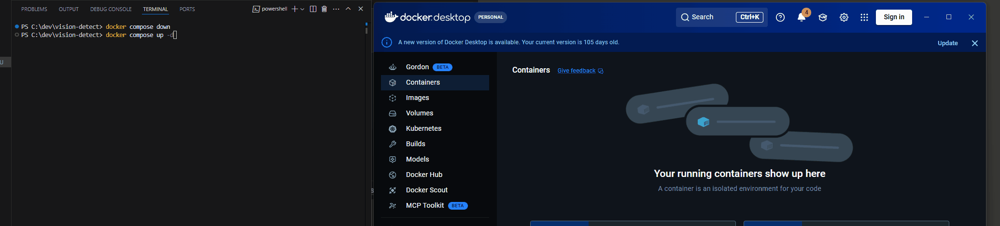

# 工程紀錄

> vision-detect 的設計決策、實作過程中值得記錄的問題，以及已知限制。
>
> 專案說明見 [README](../README(zh).md)　·　本機啟動見 [DEVELOPMENT.md](DEVELOPMENT.md)　

---

## 一、系統概覽


手機拍下照片後立即上傳，伺服器在背景完成推論，結果同時推播到手機與桌機儀表板 —— 兩端都不需要輪詢或重新整理。

資料流經過四個獨立元件：**MAUI 行動端 → C# 業務層 → Python 推論服務 → PostgreSQL**，其中業務層另以 SignalR 將結果反向推回所有連線的客戶端。

上傳與取得結果是兩條分離的路徑：`POST` 在作業持久化後立刻返回 `202`，實際推論由背景工作者處理，完成後才透過推播通知 —— 這個設計貫穿了整個系統的其餘部分。

---

## 二、三個關鍵設計決策

### 2-1 推論在 Python，業務層在 C#

**決策**：把物件偵測放在獨立的 Python FastAPI 服務，C# 只負責業務邏輯與狀態管理。

**替代方案**：用 ONNX Runtime 在 C# 內直接推論，省掉一個服務與一次網路往返。

**選擇的理由**

視覺模型的生態在 Python。訓練、資料增強、評估、模型迭代都在那裡，而這個專案的第二階段會需要 fine-tune 自訂模型。若把推論寫在 C#，屆時仍得回到 Python 訓練、匯出 ONNX，等於兩邊都要維護。

更重要的是責任邊界變得清晰：

| | Python 推論服務 | C# 業務層 |
|---|---|---|
| 狀態 | 無狀態 | 全部狀態的擁有者 |
| 職責 | 「這張圖裡有什麼」 | 作業生命週期、去重、推播、持久化 |
| 可否隨時重啟 | 是 | 重啟會遺失行程內佇列 |
| 對外可達 | 否 | 是（經 Nginx） |

**判斷準則**：任何需要「記得上一次發生什麼」的功能都歸 C#。

**代價**

多了一個容器、一次內部網路往返，以及一條跨語言的 JSON 契約需要維護。契約定義在 [`model-service/CONTRACT.md`](../model-service/CONTRACT.md)，兩邊各自保持自己語言的命名慣例（Python `snake_case`、C# `PascalCase`），轉換集中在 `ModelServiceClient` 一個檔案。

**這個邊界帶來的好處**

第二階段換自訂模型時，只需替換一個容器內的權重檔與兩個環境變數，業務層與客戶端完全不動。

### 2-2 非同步 + 冪等，而非同步 API

**決策**：`POST /detections` 不等待推論，立刻回傳 `202 Accepted` 與作業識別碼；結果透過 SignalR 推播或 `GET /{jobId}` 查詢。

**替代方案**：同步等待推論完成後回傳完整結果 —— 客戶端程式碼會簡單很多。

**選擇的理由**

推論需要一到兩秒。同步等待會讓 HTTP 連線在這段時間被佔住，併發一高就會耗盡連線數。

但真正的理由不只是效能。這個決策讓「失敗」變成可以建模的東西：

```
Pending ──→ Processing ──→ Done
                │  ↑
                │  └── Pending（可重試的失敗，放回佇列）
                └──→ Failed（重試耗盡或不可重試）
```

同步 API 只有「成功」與「拋例外」兩種結局。有了狀態機，「服務暫時掛掉，二十秒後自己恢復」才有辦法表達。

**冪等性為什麼是必要的**

一旦引入重試，就必須處理重複。客戶端在拍照當下產生 `requestId`，隨上傳一起送出：

- 行動端離線佇列補傳時，帶的是同一個值
- 上傳其實成功了但回應在網路中斷（客戶端無從得知），重送也不會產生第二筆

去重有兩道防線：

1. **程式碼查詢** `GetByRequestIdAsync` —— 涵蓋一般情況
2. **資料庫唯一索引** —— 併發時兩個執行緒可能同時查到「不存在」，由 DB 擋下其中一個，Controller 捕捉 `DbUpdateException` 後回傳既有的那筆

只有第一道是不夠的。**把最終仲裁交給有原子性保證的那一層**，是分散式系統的典型模式。

實測：兩個併發請求帶相同 `requestId`，回應是一個 `202` 一個 `200`，資料庫只有一筆。

**兩層重試的分工**

| | HTTP 層（Polly） | 作業層（Worker） |
|---|---|---|
| 處理 | 單次呼叫內的瞬間故障 | 服務較長時間不可用 |
| 時間尺度 | 秒級（2、4、8 秒退避） | 分鐘級（間隔 20 秒） |
| 作業狀態 | 全程停在 `Processing` | 回到 `Pending` 重新排隊 |
| 上限 | 3 次重試 | 3 次嘗試 |

最壞情況是 12 次實際呼叫、橫跨約一分鐘，之後才標記 `Failed`。

實測：停掉推論服務後送出作業，日誌顯示「第 1/3 次失敗，20 秒後重試」；在等待期間重啟服務，作業自行恢復為 `Done`，`attemptCount: 2`。

**代價**

客戶端變複雜 —— 要處理「已送出但還沒有結果」的中間狀態，而且需要推播或輪詢才能取得結果。行動端因此同時實作了 SignalR 接收與輪詢備援。

### 2-3 先用系統相機，再升級成即時預覽

**決策**：行動端第一版使用 MAUI 內建的 `MediaPicker.CapturePhotoAsync()`（跳到系統相機 app），鏈路驗證通過後才改用 `CommunityToolkit.Maui.Camera` 的 `CameraView`。

**替代方案**：一開始就做即時預覽。

**選擇的理由**

第六步真正要驗證的是這條鏈路：

```
拍照 → 離線佇列 → 上傳 → 202 → 背景推論 → SignalR 推播 → 手機與桌機同時顯示
```

它橫跨四個元件，任一環出錯都會失敗。若同時處理「即時相機」與「跨元件通訊」，出問題時無法判斷是相機的問題還是網路的問題。

`MediaPicker` 只要五行程式碼，是最短路徑。

**升級的成本驗證了分層是對的**

改用 `CameraView` 時**只動了三個檔案**：`CameraPage.xaml`、`CameraPage.xaml.cs`、`MauiProgram.cs`。

完全沒動的：`ApiService`、`OfflineQueueService`、`HubService`、`CrosshairDrawable`、資料模型、`AndroidManifest.xml`，以及整個後端。

原因是這些元件處理的是「檔案路徑」，不管影像從哪裡來 —— 這在第一版就決定好了。

**升級後的實際差異**

| | `MediaPicker` | `CameraView` |
|---|---|---|
| 使用者體驗 | 跳到系統相機 app | 全程在 app 內 |
| 圓形準心的作用 | 疊在拍完的照片上，形同裝飾 | 疊在即時畫面上，真正用來對準 |
| 連續拍攝 | 每次進出系統相機 | 按一下就好 |
| 額外權限 | 需要 `WRITE_EXTERNAL_STORAGE`（Android 12 以下） | 只需 `CAMERA` |

值得注意的是 `CameraView` 反而**不需要儲存權限** —— 影像串流直接交給 app，不經過系統相簿。

---

## 三、四個值得記錄的問題

這四個問題有一個共同主題：**系統沒有壞掉，但也沒有在做該做的事，而且從外部看不出來。**

### 3-1 作業卡在 Processing —— 狀態機必須讓每條路徑落到終態

**現象**

停掉推論服務後送出作業，狀態永遠停在 `Processing`。查詢 API 一直回傳處理中，客戶端無止盡等待。

**原因**

`InferenceWorker.ProcessAsync` 只捕捉了 `ModelServiceException`：

```csharp
catch (ModelServiceException ex)
{
    await Fail(repository, record, ex.Message, ct);
}
```

但「連不上服務」拋的是 `HttpRequestException`，「呼叫逾時」拋的是 `TaskCanceledException` —— 兩者都不是 `ModelServiceException`。例外冒到外層迴圈的通用 catch，只記了 log，**沒有更新狀態**。

**根本問題**

> 「服務回錯誤」和「服務連不上」是兩種不同的失敗，程式碼只處理了前者。

`ModelServiceException` 代表「模型服務有回應，但回的是錯誤碼」。服務根本沒起來時，連 HTTP 回應都沒有。

**修正**

補上兩個 catch，順序很重要：

```csharp
catch (OperationCanceledException) when (ct.IsCancellationRequested)
{
    // 應用正在關閉。作業留在 Processing，不算失敗。
    _logger.LogWarning("作業 {JobId} 因應用關閉而中斷", jobId);
    throw;
}
catch (Exception ex)
{
    // 連不上、逾時、解析失敗等未預期狀況。
    // 沒有這個 catch 的話，作業會永遠卡在 Processing。
    await Fail(repository, record, $"{ex.GetType().Name}: {ex.Message}", ct);
}
```

連帶修正兩處：

**`Fail` 用 `CancellationToken.None` 寫入資料庫** —— 否則「因為取消而失敗」的作業，會因為 token 已取消而寫不進失敗狀態，又卡住了。

**`FailureReason` 截斷到 500 字** —— 資料庫欄位有長度限制，例外訊息可能更長，超過會拋 `DbUpdateException`。

**學到的**

**「卡在處理中」比「明確失敗」更糟。** 明確失敗至少讓使用者知道要重試；卡住則是無盡的等待。

任何有狀態機的系統，都要確保每一條路徑都會落到終態。

修正後實測：`"status":"Failed"`、`"failureReason":"HttpRequestException: 無法連線，因為目標電腦拒絕連線。 (localhost:8000)"`，且僅耗時 4 秒 —— 「連線被拒絕」是立即錯誤，不需要等逾時。

### 3-2 SignalR 靜默降級 —— 讓錯誤設定直接報錯而非降級

**問題的性質**

SignalR 預設會先協商傳輸方式。若反向代理沒有正確設定 WebSocket 升級，它會**靜靜退回長輪詢** —— 功能看起來完全正常，但失去即時性，而且極難察覺。

**預防措施**

前端明確指定 WebSocket 並跳過協商：

```javascript
.withUrl(HUB_URL, {
  transport: HttpTransportType.WebSockets,
  skipNegotiation: true,
})
```

這樣連不上時會直接報錯，問題浮出檯面而不是被藏起來。

**Nginx 端對應的設定**

```nginx
location /hub/ {
    proxy_pass http://api:8080/hub/;

    proxy_http_version 1.1;
    proxy_set_header Upgrade    $http_upgrade;
    proxy_set_header Connection "upgrade";
    proxy_set_header Host       $host;

    # WebSocket 是長連線，逾時要拉長
    proxy_read_timeout 3600s;
    proxy_send_timeout 3600s;
}
```

**這個選擇在部署時得到回報**

第七步容器化後，儀表板右上角的連線指示器是綠色的 —— 代表 WebSocket 確實通過 Nginx 完成升級。若設定有誤，指示器會是紅色，而不是「看起來正常但其實在輪詢」。

**同一個原則的另一個應用：連線狀態指示器**

即時推播斷線時，畫面看起來完全正常，只是不再更新。桌機與行動端都加了連線指示器（綠點呼吸動畫 / 紅點），讓「沒有新資料」和「連線中斷」能被區分開。

沒有它的話，使用者會以為系統沒事，其實資料已經停止流入。

**衍生的設計**

行動端同時實作 SignalR 與輪詢備援，哪個先到就用哪個。實測顯示推播不可用時，輪詢仍在 122 ms 內取得結果 —— 雙保險有實際作用。

### 3-3 容器內 `IsDevelopment()` 永遠 false —— 環境差異

**現象**

```
Npgsql.PostgresException: 42P01: relation "detection_records" does not exist
```

本機 `dotnet run` 完全正常，一放進容器就找不到資料表。

**原因**

`Program.cs` 的自動建表寫成：

```csharp
if (app.Environment.IsDevelopment())
{
    // EnsureCreated()
}
```

而 `docker-compose.yml` 設定了 `ASPNETCORE_ENVIRONMENT: Production`，這個判斷**永遠是 false**。

**修正**

改為由設定控制，而非依環境判斷：

```csharp
if (builder.Configuration.GetValue("Database:AutoCreate", true))
{
    using var scope = app.Services.CreateScope();
    scope.ServiceProvider.GetRequiredService<VisionDbContext>().Database.EnsureCreated();
}
```

**同一類問題的其他實例**

容器化過程中，「本機能跑不代表容器裡能跑」出現了三次：

| 差異 | 症狀 |
|---|---|
| 環境變數不同（Development vs Production） | 資料表不會建立 |
| 可用工具不同 | `mcr.microsoft.com/dotnet/aspnet` 為了精簡，**既沒有 curl 也沒有 wget**，健康檢查永遠失敗 |
| 網路視角不同 | `localhost:8080` 從你的電腦看是 pgAdmin，從 api 容器內部看是 API 自己 |

第二項的診斷方式值得記下來：

```powershell
docker inspect vd_api --format "{{json .State.Health}}" | ConvertFrom-Json |
  Select-Object -ExpandProperty Log | Select-Object -Last 3 ExitCode, Output
# ExitCode 1   /bin/sh: wget: not found
```

它直接顯示健康檢查的實際輸出，不用猜。

**學到的**

這些差異在本機開發時完全不會遇到，只有真的容器化才會浮現。**所以部署不能留到最後一刻才做** —— 越晚做，累積的差異越多，一次要處理的問題也越多。

另一個心得：**先確認服務本身能不能用，再查周邊機制。** 有兩個容器顯示 `unhealthy`，但服務其實都正常運作，壞的是健康檢查指令本身。若一開始就往「服務壞了」的方向查，會白費很多時間。

### 3-4 Debug 版 Fast Deployment 閃退 —— 部署方式的隱含前提

**現象**

手動把 APK 拖進手機安裝後，點開 app 立刻閃退。

**日誌**

```
F monodroid: No assemblies found in
  '/data/user/0/com.companyname.visioncapture/files/.__override__/arm64-v8a'
  or '<unavailable>'. Assuming this is part of Fast Deployment. Exiting...
F libc: Fatal signal 6 (SIGABRT)
```

**原因**

Debug 組態預設啟用 **Fast Deployment**：為了加快部署速度，.NET assemblies 不打包進 APK，而是由 ADB 另外推送到裝置的 `.__override__` 目錄。

手動安裝 APK 時那些檔案不存在，執行期找不到 assemblies 就中止。

**修正**

| 部署方式 | 適用組態 |
|---|---|
| `dotnet build -t:Run -f net10.0-android`（透過 ADB） | Debug（Fast Deployment 正常運作） |
| 手動安裝 APK | **Release**（所有內容包在 APK 裡） |

```powershell
dotnet publish -f net10.0-android -c Release
# 產出 bin\Release\net10.0-android\publish\*-Signed.apk
```

**學到的**

「手動安裝 APK」和「透過 ADB 部署」不是同一件事，而這個前提沒有寫在任何顯眼的地方 —— 它藏在建置組態的預設值裡。

**同類問題：權限的版本差異**

另一個閃退來自 `MediaPicker` 在 **Android 12（API 32）以下**需要 `WRITE_EXTERNAL_STORAGE`：

```
[PermissionException]: You need to declare using the permission:
`android.permission.WRITE_EXTERNAL_STORAGE` in your AndroidManifest.xml
```

原本的註解寫「不需要外部儲存權限」—— 那句話只對 Android 13+ 成立。測試機正好是 Android 12。

```xml
<!-- MediaPicker 在 Android 12 以下需要，13 以上由範圍儲存取代 -->
<uses-permission android:name="android.permission.WRITE_EXTERNAL_STORAGE"
                 android:maxSdkVersion="32" />
```

`maxSdkVersion="32"` 讓權限只對舊版生效。

---

## 四、部署



```bash
cp .env.docker.example .env    # 修改密碼
docker compose up -d
```

開啟 <http://localhost> 即可使用。

### 拓樸

.png)

四個容器，對外只發布一個連接埠：

| 容器 | 對外 | 說明 |
|---|---|---|
| `vd_frontend` | **:80** | Nginx 提供 Vue 靜態檔，反向代理 `/api/*` 與 `/hub/*` |
| `vd_api` | 無 | ASP.NET Core：作業佇列、SignalR、韌性策略 |
| `vd_model` | 無 | FastAPI：無狀態推論 |
| `vd_postgres` | 無 | 資料持久化 |
| `vd_pgadmin` | :8080 | 資料庫管理介面 |

`:9000`、`:8000`、`:5432` 僅透過開發專用的 `docker-compose.override.yml` 開放。客戶端部署沒有該檔案，這些連接埠不存在。

### 三個部署決定

**正式環境不需要 CORS。** Nginx 同時提供靜態檔並代理 API，瀏覽器看到的是同一個來源。CORS 設定只在開發階段（Vue 於 5173、API 於別的埠）生效。

**模型權重在建置階段下載，不留到執行時。** 留到執行時的話，容器每次重建都要重抓，無網路環境會直接啟動失敗。

**多階段建置。** 前端從 500 MB 降到約 70 MB，後端從 800 MB 降到約 250 MB。最終映像裡沒有原始碼與建置工具，攻擊面也小很多。

---

## 五、已知限制與未修正缺陷

### 5-1 架構層級的限制

這些是刻意的取捨，不是疏漏。

| 限制 | 理由 |
|---|---|
| 行程內佇列（`Channel<T>`），非持久化訊息代理 | 單一實例足夠；導入代理會多一個容器，但在此規模學不到新東西。代價是**重啟會遺失佇列中的作業** |
| 單一 API 實例 | SignalR 跨副本需要 backplane，超出專案範圍 |
| 無使用者帳號 | 以 `deviceId` 識別裝置，未建模認證授權 |
| 影像存於本機 volume | 非物件儲存；單機部署足夠，但不利水平擴充 |
| 未使用 GPU | CPU 推論約 60–200 ms，對「拍攝後檢視」的工作流程可接受 |
| 只支援 Android | iOS 需要 Mac 才能建置。`TargetFrameworks` 加回即可，程式碼不用改 |
| 無 HTTPS | 需要憑證與網域，超出本機部署範圍 |

### 5-2 未修正的缺陷

**① 設定伺服器位址後不會自動重連 SignalR**

首次設定位址並儲存後，狀態列仍顯示紅點。要重啟 app 才會變綠點。

原因是 `HubService.ConnectAsync()` 開頭有 `if (_connection is not null) return;` —— `OnAppearing` 時已用舊位址建立過連線物件，之後再呼叫就直接返回。

同樣的問題也發生在**網路中斷後恢復**時：連線物件還在（只是斷了），不會重建。

建議的修法是加上 `ReconnectAsync()`，在位址變更與偵測到未連線時呼叫。

目前的緩解方式是重啟 app。

**② 離線佇列的補傳時機受限**

補傳只在 `OnAppearing`（切換分頁）時觸發。網路恢復後若使用者不切分頁，待傳項目會一直留著。

實務上應監聽 `Connectivity.ConnectivityChanged` 事件，網路恢復時自動觸發。

**③ 等待中的重排會在重啟時遺失**

作業層重試用背景 `Task.Delay` 實作，不阻塞工作者處理其他作業。代價是應用重啟時這些等待中的重排會消失 —— 與行程內佇列同源的限制。

**④ 日誌噪音**

目前使用內建 logger，Polly 每次重試都印完整堆疊追蹤，EF Core 印出每一條 SQL。導入 Serilog 並調整各套件的日誌層級可以明顯改善。

**⑤ 前端功能未完整**

後端已預留 `from`、`to`、`label`、`deviceId`、`status` 篩選參數，Vue 儀表板尚未實作對應的 UI。標註後影像（把偵測框畫回原圖）也尚未實作。

**⑥ 過時 API 警告**

行動端有六個編譯警告：`DisplayAlert` 應改為 `DisplayAlertAsync`（三處），事件處理器的 `object sender` 應為 `object? sender`（三處）。不影響功能。

### 5-3 測試涵蓋範圍

後端有 50 個測試，**完全不需要 Docker、PostgreSQL 或 Python 服務**即可執行：

| 專案 | 數量 | 涵蓋 |
|---|---|---|
| Core.Tests | 17 | 作業狀態機的合法與非法轉移 |
| Infrastructure.Tests | 19 | 模型服務客戶端契約、佇列行為、錯誤分類 |
| Data.Tests | 15 | 資料存取、往返一致性、去重、關聯刪除 |

模型服務有 12 個 pytest 測試，涵蓋三個端點的正常與錯誤路徑。

**未涵蓋的**：端到端整合測試、行動端邏輯、Vue 元件、模型準確度（為第三階段評估報告的範圍）。

---

